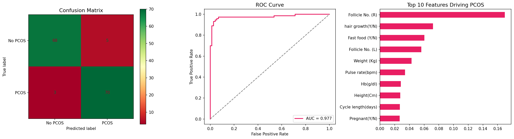
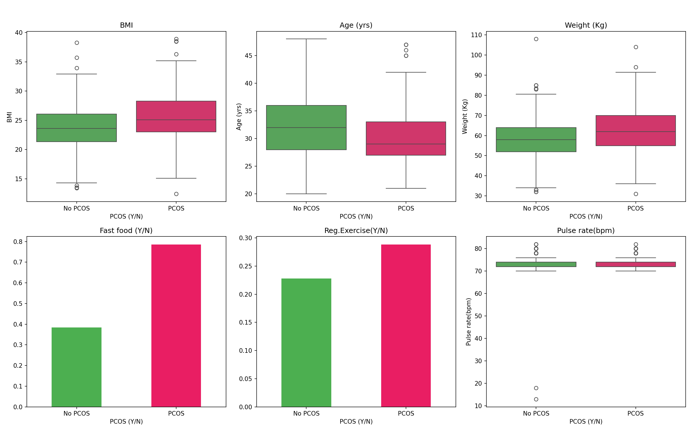

# 🌸 PCOS Health Advisor

**A machine learning web app that predicts PCOS risk and delivers personalized nutrition recommendations based on clinical markers and lifestyle symptoms.**

[](https://pcos-health-advisor-hnn7jixx79itp6dtgnk574.streamlit.app/)
[](https://python.org)
[](https://xgboost.readthedocs.io)
[](https://streamlit.io)

---

## 🎯 Problem Statement

PCOS (Polycystic Ovary Syndrome) affects **1 in 10 women** of reproductive age worldwide. Despite being so common, most women wait years for a diagnosis and receive little actionable guidance on lifestyle changes. This app bridges that gap — giving women an instant, data-driven risk assessment and personalized nutrition plan based on their symptoms.

---

## 🚀 Live Demo

👉 **[Try the App Here](https://pcos-health-advisor-hnn7jixx79itp6dtgnk574.streamlit.app/)**

**How it works:**
1. Enter your health metrics (age, BMI, cycle info, symptoms)
2. Click **Analyze My PCOS Risk**
3. Get your risk level + personalized foods to eat/avoid + a 3-day meal plan

---

## 📊 Model Performance

| Metric | Score |
|--------|-------|
| Accuracy | **95%** |
| ROC-AUC | **97.7%** |
| Precision | 95% |
| Recall | 95% |



---

## 🔍 Key Findings from EDA

- **Fast food consumption** is 2x higher in PCOS patients (78% vs 38%)
- **BMI and weight** are significantly elevated in PCOS patients
- **Follicle count** is the strongest single predictor of PCOS
- **Excess hair growth** is a top-3 clinical indicator



---

## 🛠️ Tech Stack

| Layer | Technology |
|-------|-----------|
| Language | Python 3.10 |
| ML Model | XGBoost + SMOTE (class balancing) |
| Data Processing | Pandas, NumPy, Scikit-learn |
| Visualization | Matplotlib, Seaborn |
| Frontend | Streamlit |
| Nutrition API | USDA FoodData Central (live API) |
| Deployment | Streamlit Cloud |

---

## 📁 Project Structure

```
pcos-health-advisor/
├── App.py                  # Streamlit web application
├── pcos_model.pkl          # Trained XGBoost model
├── feature_columns.pkl     # Feature column names
├── requirements.txt        # Python dependencies
├── eda_features.png        # EDA visualization
└── model_results.png       # Model evaluation charts
```

---

## 🧠 How the Recommendation Engine Works

The app uses a **two-layer approach**:

1. **ML Layer** — XGBoost model trained on 541 clinical patient records predicts PCOS risk (Low / Moderate / High) with 95% accuracy
2. **Recommendation Layer** — Based on risk level + specific symptoms (hair growth, fast food, BMI, cycle length), the engine generates:
   - Personalized foods to eat and avoid
   - Symptom-specific tips (e.g., spearmint tea for excess androgens)
   - A 3-day anti-inflammatory meal plan
   - Live nutritional data via USDA API (with API key)

---

## 📦 Run Locally

```bash
# Clone the repo
git clone https://github.com/Hemasreech39/pcos-health-advisor.git
cd pcos-health-advisor

# Install dependencies
pip install -r requirements.txt

# Run the app
streamlit run App.py
```

---

## 📊 Dataset

- **Source:** [PCOS Dataset — Kaggle](https://www.kaggle.com/datasets/prasoonkottarathil/polycystic-ovary-syndrome-pcos)
- **Size:** 541 patients × 45 clinical features
- **Features include:** BMI, follicle count, hormone levels, lifestyle factors, cycle regularity

---

## ⚠️ Disclaimer

This tool is for **informational and educational purposes only**. It is not a substitute for professional medical diagnosis or advice. Always consult a qualified healthcare provider for medical decisions.

---

## 👩‍💻 About

Built by **Hemasree Chilamkurthy**  
MS Computer Science | University of Alabama at Birmingham  
📧 chilamkurthyhemasree@gmail.com  
🔗 [LinkedIn](https://linkedin.com/in/hemasree-chilamkurthy)
